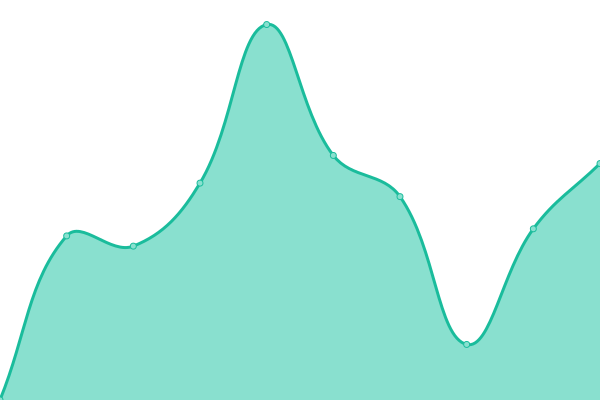
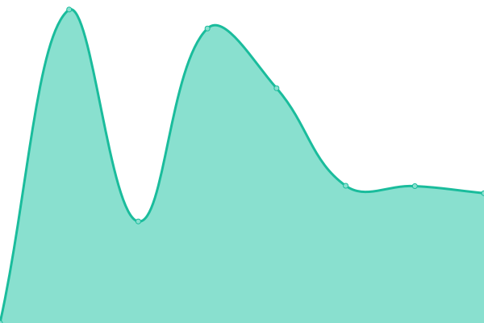

# [📈 Live Status](https://TychoWerner.github.io/upptime): <!--live status--> **🟧 Partial outage**

This repository contains the open-source uptime monitor and status page for [Tycho Werner](https://TychoWerner.github.io/upptime), powered by [Upptime](https://github.com/upptime/upptime).

With [Upptime](https://upptime.js.org), you can get your own unlimited and free uptime monitor and status page, powered entirely by a GitHub repository. We use [Issues](https://github.com/TychoWerner/upptime/issues) as incident reports, [Actions](https://github.com/TychoWerner/upptime/actions) as uptime monitors, and [Pages](https://TychoWerner.github.io/upptime) for the status page.

<!--start: status pages-->
<!-- This summary is generated by Upptime (https://github.com/upptime/upptime) -->
<!-- Do not edit this manually, your changes will be overwritten -->
<!-- prettier-ignore -->
| URL | Status | History | Response Time | Uptime |
| --- | ------ | ------- | ------------- | ------ |
|  [CeltCast](https://www.celtcast.com) | 🟩 Up | [celt-cast.yml](https://github.com/TychoWerner/upptime/commits/HEAD/history/celt-cast.yml) | 

 1956ms
     
 | 

<a href="https://TychoWerner.github.io/upptime/history/celt-cast">98.65%</a>
    

|  [Fantasy-Awards](https://fantasy-awards.com) | 🟩 Up | [fantasy-awards.yml](https://github.com/TychoWerner/upptime/commits/HEAD/history/fantasy-awards.yml) | 

 587ms
     
 | 

<a href="https://TychoWerner.github.io/upptime/history/fantasy-awards">100.00%</a>
    

|  [AzuraCast](https://azuracast.tychowerner.nl) | 🟩 Up | [azura-cast.yml](https://github.com/TychoWerner/upptime/commits/HEAD/history/azura-cast.yml) | 

 542ms
     
 | 

<a href="https://TychoWerner.github.io/upptime/history/azura-cast">100.00%</a>
    

|  [ListMonk](https://listmonk.tychowerner.nl) | 🟩 Up | [list-monk.yml](https://github.com/TychoWerner/upptime/commits/HEAD/history/list-monk.yml) | 

 295ms
     
 | 

<a href="https://TychoWerner.github.io/upptime/history/list-monk">100.00%</a>
    

|  [NewsLetter](https://newsletter.celtcast.com) | 🟥 Down | [news-letter.yml](https://github.com/TychoWerner/upptime/commits/HEAD/history/news-letter.yml) | 

 1603ms
     
 | 

<a href="https://TychoWerner.github.io/upptime/history/news-letter">99.29%</a>
    

|  [Gimmes.net](https://gimmes.net) | 🟩 Up | [gimmes-net.yml](https://github.com/TychoWerner/upptime/commits/HEAD/history/gimmes-net.yml) | 

 493ms
     
 | 

<a href="https://TychoWerner.github.io/upptime/history/gimmes-net">100.00%</a>
    

|  [TychoWerner.nl](https://tychowerner.nl) | 🟥 Down | [tycho-werner-nl.yml](https://github.com/TychoWerner/upptime/commits/HEAD/history/tycho-werner-nl.yml) | 

 60ms
     
 | 

<a href="https://TychoWerner.github.io/upptime/history/tycho-werner-nl">0.00%</a>
    

|  [TostiBroeders.nl](https://tostibroeders.nl) | 🟩 Up | [tosti-broeders-nl.yml](https://github.com/TychoWerner/upptime/commits/HEAD/history/tosti-broeders-nl.yml) | 

 1243ms
     
 | 

<a href="https://TychoWerner.github.io/upptime/history/tosti-broeders-nl">100.00%</a>
    

|  [CeltiCast.com](https://celticast.com) | 🟩 Up | [celti-cast-com.yml](https://github.com/TychoWerner/upptime/commits/HEAD/history/celti-cast-com.yml) | 

 539ms
     
 | 

<a href="https://TychoWerner.github.io/upptime/history/celti-cast-com">100.00%</a>
    

|  [PartyRegelaar](http://partyregelaar.nl) | 🟩 Up | [party-regelaar.yml](https://github.com/TychoWerner/upptime/commits/HEAD/history/party-regelaar.yml) | 

 2190ms
     
 | 

<a href="https://TychoWerner.github.io/upptime/history/party-regelaar">100.00%</a>
    

|  [PartyVerhuur Alphen](https://www.partyverhuuralphenaandenrijn.nl) | 🟩 Up | [party-verhuur-alphen.yml](https://github.com/TychoWerner/upptime/commits/HEAD/history/party-verhuur-alphen.yml) | 

 2963ms
     
 | 

<a href="https://TychoWerner.github.io/upptime/history/party-verhuur-alphen">100.00%</a>
    

|  [PartyVerhuur Ter Aar](https://www.partyverhuurteraar.nl) | 🟩 Up | [party-verhuur-ter-aar.yml](https://github.com/TychoWerner/upptime/commits/HEAD/history/party-verhuur-ter-aar.yml) | 

 2984ms
     
 | 

<a href="https://TychoWerner.github.io/upptime/history/party-verhuur-ter-aar">100.00%</a>
    

|  [PartyCentrum Parola](https://partycentrumparola.nl/) | 🟩 Up | [party-centrum-parola.yml](https://github.com/TychoWerner/upptime/commits/HEAD/history/party-centrum-parola.yml) | 

 2357ms
     
 | 

<a href="https://TychoWerner.github.io/upptime/history/party-centrum-parola">100.00%</a>
    

<!--end: status pages-->

[**Visit our status website →**](https://TychoWerner.github.io/upptime)

## 📄 License

- Powered by: [Upptime](https://github.com/upptime/upptime)
- Code: [MIT](./LICENSE) © [Tycho Werner](https://TychoWerner.github.io/upptime)
- Data in the `./history` directory: [Open Database License](https://opendatacommons.org/licenses/odbl/1-0/)
